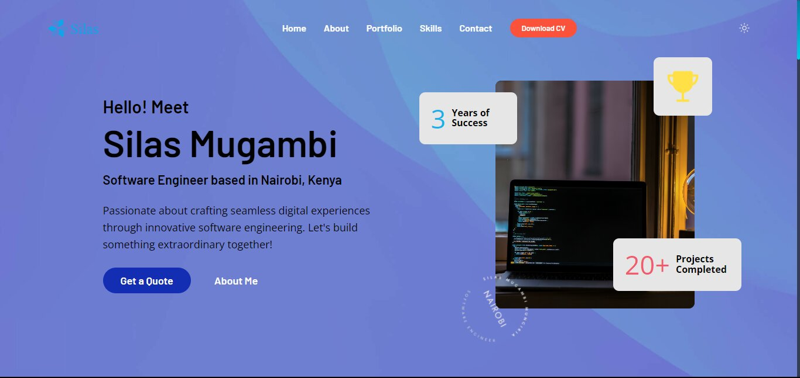

<h2>Portfolio</h2>

<h3 align="center">Project Details and Links</h3>

<p>These projects are freely available for use in building a website. They are responsive for all devices and built using HTML, CSS, and JavaScript.</p>

<h4 align="center" width="100%">Portfolio Screenshots Demo</h4>
<div align="center" width="100%">
    
</div>

<div align="center">
    <a href="https://mugambi12.github.io/personal_portfolio"><strong>➥ Live Demo</strong></a>
</div>

### Prerequisites

Before you begin, ensure you have met the following requirements:

- [Git](https://git-scm.com/downloads "Download Git") must be installed on your operating system.

### Run Locally

To run **these elements** locally, run this command on your git bash:

Linux and macOS:

```bash
sudo git clone https://github.com/Mugambi12/personal_portfolio.git
```

Windows:

```bash
git clone https://github.com/Mugambi12/personal_portfolio.git
```

#### License

This project is licensed under the [MIT License](https://choosealicense.com/licenses/mit/).

---
